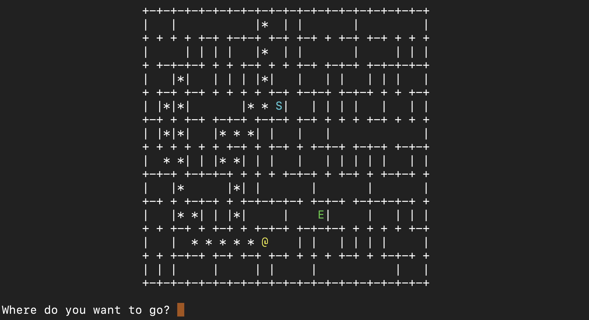

# Maze
 
## Getting Started

### Prerequisites
* **ruby**: 
  This program was written in `ruby 3.1.2p20`. Your computer may already have *Ruby* installed. You can check by:
  ```
  ruby -v
  ```
  Otherwise, you can head over to their installation documentation over <a href="https://www.ruby-lang.org/en/documentation/installation/"     target="_blank">here (ruby-lang.org)</a>.

* **colorize**: 
  To display colorful text, install the `colorize (0.8.1)` gem:
  ```
  gem install colorize
  ```
  Unix systems may require `sudo`. <a href="https://github.com/fazibear/colorize" target="_blank">Link to repo (github.com/fazibear)</a>.
  
<br><hr>

### Running the Game Locally

To get the game running locally on your terminal, clone the repo to your desired directory:
```
git clone https://github.com/SamAdrn/Maze.git
```
Then, enter the the `Maze` directory:
```
cd Maze
```
And finally, run the [`runner.rb`](runner.rb) file through the `ruby` command:
```
ruby runner.rb
```

<br>

## The Game
### Welcome to **MAZE GAME**



The whole point of the game is to get from the starting point of the maze `S` all the way to the ending point of the maze `E`, and see if you can get that **treasure**. You can also feel extra proud if you managed to solve the maze through the shortest path possible.

<br>

But if you are having trouble, you can have the game *show you da way*.


<br><hr>

### Starting Up
At the start of the game, you will be instructed to choose an algorithm for the maze you want to create.


Each algorithm produces its own kind of maze texture:
1. **Randomized Depth-First Search**: High *River* Factor. Has long corridors since it traverses as deep as it can before backtracking.
2. **Randomized Kruskal's Algorithm**: High *Branching* Factor. Has a lot of dead ends since it grows minimum spanning trees from various points within the graph.

<br>

Then, you can specify the size of your mazes:


* Mazes must at least be a `2 x 2` (there's no point in having smaller mazes really).
* Heights are displayed larger than widths. A maze with the dimensions `(w / 2) x w` will resemble a square.

<br>

Now, the game knows exactly what you want and will create a random maze for you depending on the algorithm you chose.


*  Note that these algorithms may not create a solvable maze in the first try, and it may re-run the algorithm over and over again until it creates on that is solvable. Therefore, larger mazes may take more time to complete.

<br>

From here, you are able to choose between various commands that interact with the maze.


<br><hr>

### Documentation

Most of the code are documented within the source file. However, you can view all this documentation using [YARD (a Ruby Documentation Tool)](https://yardoc.org/).

To do this, make sure you have the `yard` gem installed:
```
gem install yard
```

Then, run this command to document all files (including `private` methods) into a web document:
```
yardoc --private maze.rb runner.rb
```

You can then open the web document using the following command:
```
open doc/top-level-namespace.html 
```      

<br><hr>

> Written [07/01/2022]
